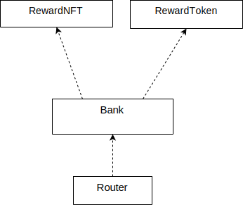
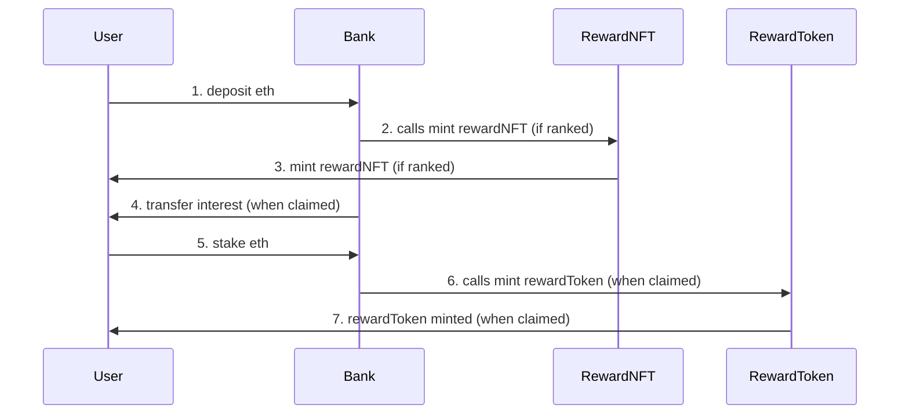
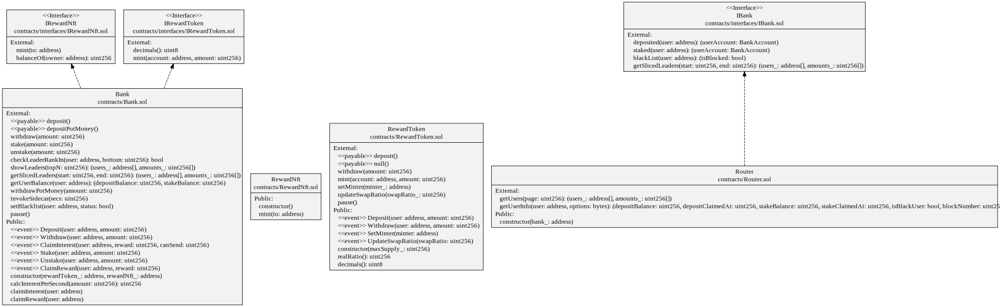

```
*이 부분은 건드리지 말 것*
Code Version 1.1.3
```

# Sooho Developer Exercise

- 이름: 박장호
- email: riki.is.working@gmail.com

## 개요

솔리디티로 구현하는 온라인 뱅킹서비스, 고객이 예치하는 Ethereum에 따라 이자를 제공한다

## 컨트랙트

- Bank.sol: 뱅킹기능을 담고 있다, 예금, 적금, 이자제공 기능 등을 담고있다.
- RewardNft.sol: 예금 1위 유저에게 보상으로 지급되는 NFT.
- RewardToken.sol: 적금 유저에게 이자로 지급되는 토큰.
- Router.sol: Bank.sol의 정보를 조회할떄 사용하는 유틸성 컨트랙트.

## 구조



- Bank에서 minting하기 위해 RewardNft와 RewardToken을 참조
- Router에서 정보를 조회하기 위해 Bank를 참조

### seuqnce diagram



### UML Diagram

<details>
    <summary> 펼쳐보기 </summary>
    
</details>

## 참고

- interface는 외부 컨트랙트 호출용으로 작성한다고 가정하고 작성함, 호출되지 않는 함수들은 interface에서 생략함
- `IBank.sol` 인터페이스에서 `BankAccount` struct가 한번 더 선언되었는데, 이를 library에 선언하고 lib.BankAccount식으로 인터페이스와 컨트랙트 양측에서 호출해도 좋았을 것 같다. 채점에 영향이 있을까봐 선언문을 변경하지는 않았다.

### RewardToken

- address(this)의 eth balance에 직접 접근하기 보다 totalEthSupply변수에 총 이더를 저장함, `selfDestruct`를 이용한 의도치 않은 eth입금을 방지하기 위함
- `withdraw()`시 RewardToken을 burn처리함
- `realRatio()` 에서는 divisionByZero를 방지하기 위해 totalSupply()가 0일때 0을 반환하도록 함
- mint시 totalSupply()가 maxSupply를 초과하면 안된다 생각해서 `totalSupply() + amount <= maxSupply`로 revert처리함

### Bank

- `withdraw()`에서는 claimInterest처럼 potMoney수량이 부족하다고 출금액을 줄이지는 않았음, 사용자가 입금한 금액은 그대로 컨트랙트에 있다고 가정함
- 입금액1위 고객을 구하기 위해 deposit할때마다 순위를 따로 연산하거나, sortedArray를 사용하는것보다 currentLeader이라는 변수를 두고 최고입금고객만 비교하는게 더 저렴하다고 생각함
- `staked`나 `deposited`에 접근할때 memory 변수에 할당할까 하였으나, 코드 가독성을 위해 스토리지 변수를 참조하도록함
- iteration을 관련 고려사항
  - 가능하면 iteration이 필요한 리스트는 offchain에 저장하는게 더 좋다고 생각함
  - users의 index는 1부터 시작함, 왜냐하면 userIndex에서 index를 가져올때 0값이 아직 등록 안된 고객인지 index가 0인 고객인지 구분할 수 없기 때문
  - 예적금이 없는 유저는 삭제될 수 있도록 removeUser()함수를 추가함
  - 금액별 sorting은 view함수 호출시 수행하도록 했으며, 256개항목이면 insertionSort알고리즘을 사용하여도 차이가 크지 않을 줄 알았으나, quickSort에 비해 5배정도 느림

### Router

- view함수 임력값에 따른 예외처리는 호출하는 측에서 할것으로 가정함
- `getUserInfo()`의 `option`값이 false라면 타입별 기본값을 반환한다고 가정함
